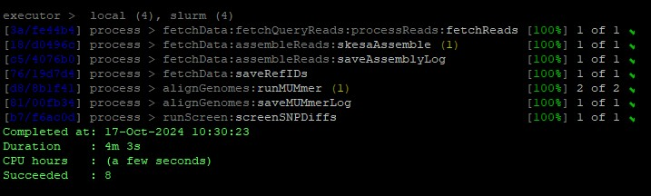
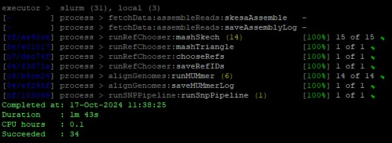

<p align="center">
  
</p>

# CFSAN SNP Pipeline 2 (CSP2)  
#### Dr. Robert Literman
**Office of Analytics and Outreach**  
**Center for Food Safety and Applied Nutrition**  
**US Food and Drug Administration**  
  
**Current Release**: [v.0.9.5 (Oct-17-2024)](https://github.com/CFSAN-Biostatistics/CSP2/releases/tag/v.0.9.5)  
**Last Push**: Oct-17-2024

**Important Note:** *CSP2 is currently under development, and has not been validated for non-research purposes. Current workflows and data processing parameters may change prior to full release version.*

## CSP2 is a Nextflow pipeline for rapid, accurate SNP distance estimation from assembly data  

CSP2 runs on Unix, with the handful of dependencies listed in the [Software Dependencies](#software-dependencies) section. CSP2 was developed to **(1)** improve on the speed of the [CFSAN SNP Pipeline (CSP)](https://peerj.com/articles/cs-20/?report=reader), **(2)** to reduce computational burden when analyzing larger isolate clusters, and **(3)** to remove the dependency for raw Illumina data. CSP2 relies on the accurate and rapid alignment of genome assemblies provided by [MUmmer](https://github.com/mummer4/mummer), which typically complete within seconds. This provides significant reductions in runtime compared to methods that rely on read mapping. The use of assemblies in place of sequencing data also means that:  

- the amount storage needed can be substantially reduced, 
- significantly less computational resources are required, 
- as long as assemblies are available, isolates can be compared regardless of sequencing platform or whether publicly available sequence data even exists   

CSP2 runs are managed via Nextflow, providing the user with an array of [customizations](#tips-for-configuring-csp2) while also facilitating module development and additions in future releases. 

**Important Note**: *The software continues to be focused on the analysis of groups of bacterial genomes with limited evolutionary differences (<1000 SNPs). Testing is underway to determine how the underlying cluster diversity impacts distances estimates.*

### CSP2 has two main run modes (See [Examples](#examples)):  

#### 1) "Screening Mode" (*--runmode screen*):  Used to determine whether query isolates are close to a set of reference isolates (e.g., lab control strains, strains related to an outbreak, etc.)    
Given one or more user-provided reference isolates (*--ref_reads*; *--ref_fasta*), get alignment statistics and SNP distances between all reference and query isolates (*--reads*; *--fasta*)
   
#### 2) "SNP Pipeline Mode" (*--runmode snp*): Used to generate pairwise distances and alignments for a set of query isolates
Generate pairwise SNP distances and alignments for 2+ isolates (*--reads*; *--fasta*) based on comparisons to:  
- One or more user-provided references (*--ref_reads*; *--ref_fasta*), or  
- One or more reference isolates selected by RefChooser (*--n_ref*)

All CSP2 sequence comparisons happen at the assembly level, but if reads are provided CSP2 will perform a genome assembly using *SKESA*. In either case, CSP2 then calls MUMmer for alignment. If a sufficient portion of the reference genome is aligned (*--min_cov*), that data is passed through a set of filters that largely mimic those from the CFSAN SNP Pipeline, including the automated removal of:  
- Sites from short alignments (*--min_len*)  
- Sites from poorly aligned contigs (*--min_iden*)
- Sites close to the contig edge (*--query_edge*/*--ref_edge*)
- Sites from regions of high SNP density (*--dwin*/*--wsnps*)
- Multiply aligned sites
- Non-base sites (e.g., 'N' or '?')
- Heterozygous sites
- Indels (**for now**)

This final dataset is summarized into a *.snpdiffs* file, which contains:  
1. A one-line header with alignment statistics  
2. A BED file of contig mappings that pass QC  
3. Information about SNPs (if present)

To avoid unnecessary realignment, once a .snpdiffs file is generated under a particular set of QC parameters (which is hardcoded into the .snpdiffs file as the "QC_String") these files can be used in other CSP2 runs via the *--snpdiffs* argument (if using the same QC parameters). 

---

## Software Dependencies  
The following software are required to run CSP2. Software version used during CSP2 development noted in parentheses.  

- [Nextflow](https://www.nextflow.io/docs/latest/getstarted.html) (22.10.7)  
- [Python](https://www.python.org/downloads/) (3.8.1)  
  - [pybedtools](https://pypi.org/project/pybedtools/)  
  - [sklearn](https://scikit-learn.org/stable/)  
- [MASH](https://github.com/marbl/Mash/releases) (2.3)  
- [BEDTools](https://bedtools.readthedocs.io/en/latest/) (2.26.0)  
- [MUmmer](https://github.com/mummer4/mummer) (4.0.0)
- [BBTools](https://jgi.doe.gov/data-and-tools/software-tools/bbtools/bb-tools-user-guide/bbmap-guide/) (38.94)  
- [SKESA](https://github.com/ncbi/SKESA) (2.5.0) [Only required if starting from raw reads]  
  
---
## Installing CSP2 
CSP2 can be installed by cloning the GitHub repo and configuring the [nextflow.config](nextflow.config) and [profiles.config](conf/profiles.config) to suit your needs  

```
git clone https://github.com/CFSAN-Biostatistics/CSP2.git
```

## Tips for configuring CSP2  
CSP2 options can be specified on the command line, or through the Nextflow configuration files detailed in the next section. Feel free to skip this section if you're familiar with editing Nextflow configuration files.  

There are two main configuration files associated with CSP2:  

- The profiles.config file is where you add custom information about your computing environment, but you can also set parameters here as well. An example configuration setup (slurmHPC) is provided as a model.  
  
- In this example profile, access to the required programs relies on the loading of modules. **However**, there is no need to specify a module for Python, MUMmer, SKESA, bedtools, or MASH if those programs are already in your path. 

```
profiles {
    standard {
        process.executor = 'local'
        params.cores = 1
        params.python_module = ""
        params.mummer_module = ""
        params.skesa_module = ""
        params.bedtools_module = ""
        params.mash_module = ""
        params.bbtools_module = ""
    }
    slurmHPC {
        process.executor = 'slurm'
        params.cores = 20
        params.python_module = "/nfs/software/modules/python/3.8.1"
        params.mummer_module = "/nfs/software/modules/mummer/4.0.0"
        params.skesa_module = "/nfs/software/modules/skesa/2.5.0"
        params.bedtools_module = "/nfs/sw/Modules/bedtools"
        params.bbtools_module = "/nfs/software/modules/bbtools/38.94"
        params.mash_module = "/nfs/software/modules/mash/2.3"
        params.trim_name = "_contigs_skesa"
    }
}
```
- If you plan to run CSP2 locally, be sure to edit *params.cores* in the standard profile to match the available cores on your system  
- If you add your own profile, be sure to note it on the command line (one hypen)
```
nextflow run CSP2.nf -profile myNewProfile <args>
```
 
- The nextflow.config file is where you can change other aspects of the CSP2 run, including data location, QC parameters, and all the options listed below:

**Options with defaults include**:  

| Parameter        | Description                                                                                                | Default Value                             |
|------------------|------------------------------------------------------------------------------------------------------------|-------------------------------------------|
| --outroot        | Base directory to create output folder                                                       				      | $CWD 								                      |
| --out            | Name of the output folder to create (must not exist)                                                       | CSP2_(java.util.Date().getTime())         |
| --forward        | Full file extension for forward/left reads of query                                                        | _1.fastq.gz                               |
| --reverse        | Full file extension for reverse/right reads of reference                                                   | _2.fastq.gz                               |
| --ref_forward    | Full file extension for forward/left reads of reference                                                    | _1.fastq.gz                               |
| --ref_reverse    | Full file extension for reverse/right reads of reference                                                   | _2.fastq.gz                               |
| --readext        | Extension for single-end reads for query                                                                   | fastq.gz                                  |
| --ref_readext    | Extension for single-end reads for reference                                                               | fastq.gz                                  |
| --min_cov        | Do not analyze queries that cover less than <min_cov>% of the reference assembly                           | 85                                        |
| --min_iden       | Only consider alignments where the percent identity is at least <min_iden>%                                | 99                                        |
| --min_len        | Only consider alignments that span at least <min_len>bp                                                    | 500                                       |
| --dwin           | A comma-separated list of windows to check SNP densities                                                   | 1000,125,15                               |
| --wsnps          | The maximum number of SNPs allowed in the corresponding window from --dwin                                 | 3,2,1                                     |
| --query_edge     | Only consider SNPs that occur within <query_edge>bp of the end of a query contig                           | 150                                       |
| --ref_edge       | Only consider SNPs that occur within <query_edge>bp of the end of a reference contig                       | 150                                       |
| --n_ref          | The number of reference isolates to consider (only applied if CSP2 is choosing references)                 | 1                                         |
| --rescue         | If running in SNP Pipeline mode, rescue edge-filtered SNPs that are not edge filtered in 1+ query          | Unset (Do not rescue)                     |

**Options without defaults include**:  
| Parameter              | Description                                                                                                                        |
|------------------------|------------------------------------------------------------------------------------------------------------------------------------|
| --reads                | Location of query read data (Path to directory, or path to file with multiple directories)                                         |
| --fasta                | Location of query assembly data (Path to directory containing FASTAs, path to FASTA, file with list of multiple FASTA paths)       |
| --ref_reads            | Location of reference read data (Path to directory, or path to file with multiple directories)                                     |
| --ref_fasta            | Location of reference assembly data (Path to directory containing FASTAs, path to FASTA, path to multiple FASTAs)                  |
| --python_module        | Name of Python module if 'module load python' statement is required.                                                               |
| --mummer_module        | Name of MUmmer module if 'module load mummer' statement is required.                                                               |
| --skesa_module         | Name of SKESA module if 'module load skesa' statement is required.                                                                 |
| --bedtools_module      | Name of BEDTools module if 'module load bedtools' statement is required.                                                           |
| --mash_module          | Name of MASH module if 'module load mash' statement is required.                                                                   |
| --trim_name            | A string in assembly file names that you want to remove from sample IDs (e.g., _contigs_skesa)                                     |

---

## Examples

The [CSP2 Test Data repo](https://github.com/CFSAN-Biostatistics/CSP2_TestData) contains small test datasets to ensure things are running as expected. Here are a few examples of how you can use CSP2 in screening mode or in SNP pipeline mode. 

## Screening Mode (Example)
*Situation*: As part of a long-term microbiology experiment, you perform weekly WGS sequencing on isolates as they evolve under different selective conditions. As results, your DNA sequencing facility returns raw WGS reads and assembled genomes. 

During Week 42, analyses start detecting high numbers of mutations, and assembly-based results are not concordant with read-based results. You suspect that either the reads or assembly you were given may be from their lab control strain, but you want to check first.  

**The data**:  
  - Read data  
    - Week_42_Reads_1.fq.gz; Week_42_Reads_2.fq.gz  
  - Assembled data:  
    - Week_42_Assembly.fa  
    - Lab_Control.fasta  

  In this case, we want to use *--runmode screen*, because we want to explicitly check if either dataset matches the reference strain.  

  - **Note**: By default, CSP2 expects read data as zipped fastqs (fastq.gz), with paired-end reads denoted as _1.fastq.gz and _2.fastg.gz. These settings can be changed: 
    - Permanently in the nextflow.config file
    - Situationally in profiles.config 
    - Directly on the command line, as in the example below:
      - **Query Reads**: *--readext*; *--forward*; *--reverse*  
      - **Reference Reads**: *--ref_readext*; *--ref_forward*; *--ref_reverse*

To run this example locally, where *Nextflow*, *SKESA*, *MUMmer*, *Python*, and *BEDTools* are installed on your path, run:  

```
nextflow run CSP2.nf --out Test_Output/Contamination_Screen --runmode screen --ref_fasta assets/Screen/Assembly/Lab_Control.fasta --fasta assets/Screen/Assembly/Week_42_Assembly.fasta --reads assets/Screen/Reads --forward _1.fq.gz --reverse _2.fq.gz --readext fq.gz
```

```
nextflow run CSP2.nf                                    // Run CSP2  
--out Test_Output/Contamination_Screen                  // Save results to ./Test_Output/Contamination_Screen  
--runmode screen                                        // Compare each query to the reference
--ref_fasta assets/Screen/Assembly/Lab_Control.fasta    // Compare all queries to this reference  
--fasta assets/Screen/Assembly/Week_42_Assembly.fasta   // Include this assembly as a query
--reads assets/Screen/Reads                             // Include any read datasets from this directory as queries
--forward _1.fq.gz                                      // Forward reads don't match the default '_1.fastq.gz'
--reverse _2.fq.gz                                      // Reverse reads don't match the default '_2.fastq.gz'
--readext fq.gz                                         // Reads don't match the default 'fastq.gz'
```

If you're running on an HPC and you need to load modules, you could include your custom profile:  

```
# Load Nextflow module if necessary
module load nextflow

nextflow run CSP2.nf -profile slurmHPC --out Test_Output/Contamination_Screen --runmode screen --ref_fasta assets/Screen/Assembly/Lab_Control.fasta --fasta assets/Screen/Assembly/Week_42_Assembly.fasta --reads assets/Screen/Reads --forward _1.fq.gz --reverse _2.fq.gz --readext fq.gz
```
```
nextflow run CSP2.nf                                    // Run CSP2  
-profile slurmHPC                                       // Choose run profile (**note single hyphen**)
--out Test_Output/Contamination_Screen                  // Save results to ./Test_Output/Contamination_Screen  
--runmode screen                                        // Compare each query to the reference
--ref_fasta assets/Screen/Assembly/Lab_Control.fasta    // Compare all queries to this reference  
--fasta assets/Screen/Assembly/Week_42_Assembly.fasta   // Include this assembly as a query
--reads assets/Screen/Reads                             // Include any read datasets from this directory as queries
--forward _1.fq.gz                                      // Forward reads don't match the default '_1.fastq.gz'
--reverse _2.fq.gz                                      // Reverse reads don't match the default '_2.fastq.gz'
--readext fq.gz                                         // Reads don't match the default 'fastq.gz'
```

### Output

If all went well, you should see something like this:
<p align="center">
  
</p>

From top to bottom, we can see that CSP2:  
- Found the paired-end reads
- Assembled them using *SKESA*
- Saved an assembly log
- Aligned both queries against the reference using MUMmer
- Ran the screening script to generate the output table

Let's take a look to see what was generated:
```
ls Test_Output/Contamination_Screen

Assemblies/
Isolate_Data.tsv
logs/
MUMmer_Output/
Raw_MUMmer_Summary.tsv
Screening_Results.tsv
snpdiffs/
```
-**Note**: This output is available to inspect in [assets/Screen/Output](assets/Screen/Output)  

**Directories**  

  - *Assemblies*: Directory where any *SKESA* assemblies are stored  
  - *logs*: Directory where run logs are stored  
  - *MUMmer_Output*: Directory where raw MUMmer .snps, .report, .1coords are stored  
  - *snpdiffs*: Directory where .snpdiffs files are stored
  
**Files**
  - *Isolate_Data.tsv*: A TSV file with basic FASTA stats for each isolate

    | Isolate_ID       | Isolate_Type | Assembly_Path                                                                                                                           | Contig_Count | Assembly_Bases | N50   | N90   | L50 | L90 | SHA256                                                           |
    |------------------|--------------|-----------------------------------------------------------------------------------------------------------------------------------------|--------------|----------------|-------|-------|-----|-----|------------------------------------------------------------------|
    | Lab_Control      | Reference    | /flash/storage/scratch/Robert.Literman/NextFlow/CSP2/assets/Screen/Assembly/Lab_Control.fasta                                           | 254          | 4584986        | 41813 | 13112 | 38  | 110 | aae3a07d055bff2fa66127ca77cae35dd5cce5cc42dafea481787d4010c7dbef |
    | Week_42_Reads    | Query        | /flash/storage/scratch/Robert.Literman/NextFlow/CSP2/Test_Output/241024_Test_Output/Contamination_Screen/Assemblies/Week_42_Reads.fasta | 372          | 4561747        | 24332 | 7894  | 56  | 171 | 28eca0ecf14fcc1166ae7236c849acc08ad040cd011fc4331ba124db73601009 |
    | Week_42_Assembly | Query        | /flash/storage/scratch/Robert.Literman/NextFlow/CSP2/assets/Screen/Assembly/Week_42_Assembly.fasta                                      | 747          | 4473771        | 12782 | 3438  | 105 | 360 | 85c216de6e1bb9ccf76e7e5d64931884375d66e765f4c4fe726f3be15eb91563 |   


- *Screening_Results_PassQC.tsv*: A TSV file with screening results for all queries that made it through QC  

  | Query_ID         | Reference_ID | Screen_Category | CSP2_Screen_SNPs | Query_Percent_Aligned | Reference_Percent_Aligned | Query_Contigs | Query_Bases | Reference_Contigs | Reference_Bases | Raw_SNPs | Purged_Length | Purged_Identity | Purged_LengthIdentity | Purged_Invalid | Purged_Indel | Purged_Duplicate | Purged_Het | Purged_Density | Filtered_Query_Edge | Filtered_Ref_Edge | Filtered_Both_Edge | Kmer_Similarity | Shared_Kmers | Query_Unique_Kmers | Reference_Unique_Kmers | MUMmer_gSNPs | MUMmer_gIndels |
  |------------------|--------------|-----------------|------------------|-----------------------|---------------------------|---------------|-------------|-------------------|-----------------|----------|---------------|-----------------|-----------------------|----------------|--------------|------------------|------------|----------------|---------------------|-------------------|--------------------|-----------------|--------------|--------------------|------------------------|--------------|----------------|
  | Week_42_Assembly | Lab_Control  | Pass            | 1                | 99.1                  | 96.7                      | 747           | 4473771     | 254               | 4584986         | 1        | 0             | 0               | 0                     | 0              | 0            | 0                | 0          | 0              | 0                   | 0                 | 0                  | 97.32           | 4449973      | 746                | 121740                 | 1            | 0              |
  | Week_42_Reads    | Lab_Control  | Pass            | 50               | 99.15                 | 98.65                     | 372           | 4561747     | 254               | 4584986         | 61       | 0             | 0               | 12                    | 0              | 2            | 0                | 0          | 0              | 1                   | 1                 | 0                  | 98.51           | 4526310      | 23072              | 45403                  | 58           | 1              |  
  
  - **Columns**  

    | Column                    | Contents                                                 |
    |---------------------------|----------------------------------------------------------|
    | Query_ID                  | Name of query isolate                                    |
    | Reference_ID              | Name of reference isolate                                |
    | Screen_Category           | Pass/Fail                                                |
    | CSP2_Screen_SNPs          | SNP distance between query and reference                 |
    | Query_Percent_Aligned     | Percent of query genome aligned to reference             |
    | Reference_Percent_Aligned | Percent of reference genome aligned to query             |
    | Query_Contigs             | Contigs in query assembly                                |
    | Query_Bases               | Bases in query assembly                                  |
    | Reference_Contigs         | Contigs in reference assembly                            |
    | Reference_Bases           | Bases in reference assembly                              |
    | Raw_SNPs                  | Raw SNPs prior to filtering                              |
    | Purged_Length             | SNPs purged due to contigs less than min_len             |
    | Purged_Identity           | SNPs purged due to percent identity less than min_iden   |
    | Purged_LengthIdentity     | SNPs purged to short + low quality alignments            |
    | Purged_Invalid            | SNPs purged due to non-ACTG                              |
    | Purged_Indel              | SNPs purged as indels                                    |
    | Purged_Duplicate          | SNPs purged as duplicate alignments                      |
    | Purged_Het                | SNPs purged with heterozygous signal                     |
    | Purged_Density            | SNPs purged for having more than wsnps in dwin           |
    | Filtered_Query_Edge       | SNPs purged for being too close to query contig edge     |
    | Filtered_Ref_Edge         | SNPs purged for being too close to reference contig edge |
    | Filtered_Both_Edge        | SNPs purged for being too close to both contig edges     |
    | Kmer_Similarity           | Kmer similarity between query and reference              |
    | Shared_Kmers              | Number of shared kmers between query and reference       |
    | Query_Unique_Kmers        | Unique kmer count for query                              |
    | Reference_Unique_Kmers    | Unique kmer count for reference                          |
    | MUMmer_gSNPs              | Number of MUMmer gSNPs                                   |
    | MUMmer_gIndels            | Number of MUMmer gIndels                                 |  

- SNPDiffs Files  
  - The .snpdiffs files generated by CSP2 have three main components:  
    
    1. **Header**: The header row of a .snpdiffs file contains all the same information as the screening results TSV.  
         - To peek at a .snpdiffs header, try:
           ```
           head -1 (QUERY)__vs__(REF).snpdiffs | tr "\t" "\n"
           ```  

    2. **BED File**: Assuming sufficient overlap in assemblies, the next section will be a BED file of all the 1-to-1 overlaps between the query and reference. This section is denoted by '##\t'  
        ```
        grep "##" Week_42_Reads__vs__Lab_Control.snpdiffs | head -10
        ```  
        

        |    | Reference_Contig        | Reference_Align_Start | Reference_Align_End | Reference_Contig_Length | Reference_Contig_Aligned | Query_Contig       | Query_Align_Start | Query_Align_End | Query_Contig_Length | Query_Contig_Aligned | Percent_Identity |
        |----|-------------------------|-----------------------|---------------------|-------------------------|--------------------------|--------------------|-------------------|-----------------|---------------------|----------------------|------------------|
        | ## | SRR16119110_100_32.8137 | 0                     | 6519                | 36207                   | 6519                     | Contig_277_13.5424 | 4804              | 11323           | 11323               | 6519                 | 100              |
        | ## | SRR16119110_100_32.8137 | 6586                  | 7524                | 36207                   | 938                      | Contig_73_15.3932  | 0                 | 938             | 938                 | 938                  | 100              |
        | ## | SRR16119110_100_32.8137 | 7828                  | 36104               | 36207                   | 28276                    | Contig_8_13.8951   | 0                 | 28276           | 28276               | 28276                | 100              |
        | ## | SRR16119110_102_54.229  | 225                   | 12863               | 12876                   | 12638                    | Contig_232_18.7715 | 0                 | 12638           | 12638               | 12638                | 100              |
        | ## | SRR16119110_103_30.5388 | 143                   | 6585                | 6585                    | 6442                     | Contig_355_13.8058 | 6300              | 12742           | 12742               | 6442                 | 100              |
        | ## | SRR16119110_104_40.3209 | 0                     | 12590               | 19820                   | 12590                    | Contig_153_15.5804 | 8748              | 21338           | 21338               | 12590                | 100              |
        | ## | SRR16119110_104_40.3209 | 12664                 | 19615               | 19820                   | 6951                     | Contig_35_15.127   | 0                 | 6951            | 6951                | 6951                 | 100              |
        | ## | SRR16119110_105_32.917  | 33                    | 11125               | 11125                   | 11092                    | Contig_57_14.4746  | 37635             | 48727           | 48727               | 11092                | 100              |
        | ## | SRR16119110_106_22.2235 | 0                     | 2959                | 2959                    | 2959                     | Contig_166_11.9238 | 0                 | 2959            | 3512                | 2959                 | 100              |
        | ## | SRR16119110_107_44.0162 | 139                   | 12900               | 204844                  | 12761                    | Contig_174_15.2027 | 0                 | 12761           | 12761               | 12761                | 100              |  

    3. **SNP Data**: Finally, the third section of a .snpdiffs file contains all the data on SNPs that passed and failed QC. Only SNPs with the Category "SNP" are counted in the final distance.   
      ```
      grep -v "#" Week_42_Reads__vs__Lab_Control.snpdiffs | head -10
      ```  

      | Reference_Contig        | Reference_Loc_Start | Reference_Loc_End | Query_Contig       | Query_Loc_Start | Query_Loc_End | Ref_Loc_ID                     | Query_Loc_ID             | Reference_Alignment_Start | Reference_Alignment_End | Query_Alignment_Start | Query_Alignment_End | Reference_Base | Query_Base | Distance_to_Reference_Contig_Edge | Distance_to_Query_Contig_Edge | Reference_Aligned | Query_Aligned | Direction | Percent_Identity | Category |
      |-------------------------|---------------------|-------------------|--------------------|-----------------|---------------|--------------------------------|--------------------------|---------------------------|-------------------------|-----------------------|---------------------|----------------|------------|-----------------------------------|-------------------------------|-------------------|---------------|-----------|------------------|----------|
      | SRR16119110_107_44.0162 | 79353               | 79354             | Contig_138_15.1806 | 38294           | 38295         | SRR16119110_107_44.0162/79354  | Contig_138_15.1806/38295 | 41059                     | 116706                  | 0                     | 75647               | A              | T          | 79354                             | 37352                         | 75647             | 75647         | 1         | 99.99            | SNP      |
      | SRR16119110_107_44.0162 | 96797               | 96798             | Contig_138_15.1806 | 55738           | 55739         | SRR16119110_107_44.0162/96798  | Contig_138_15.1806/55739 | 41059                     | 116706                  | 0                     | 75647               | C              | T          | 96798                             | 19908                         | 75647             | 75647         | 1         | 99.99            | SNP      |
      | SRR16119110_107_44.0162 | 105821              | 105822            | Contig_138_15.1806 | 64762           | 64763         | SRR16119110_107_44.0162/105822 | Contig_138_15.1806/64763 | 41059                     | 116706                  | 0                     | 75647               | G              | A          | 99022                             | 10884                         | 75647             | 75647         | 1         | 99.99            | SNP      |
      | SRR16119110_107_44.0162 | 170608              | 170609            | Contig_93_15.202   | 49811           | 49812         | SRR16119110_107_44.0162/170609 | Contig_93_15.202/49812   | 120797                    | 204844                  | 0                     | 84045               | G              | A          | 34235                             | 47655                         | 84047             | 84045         | 1         | 99.99            | SNP      |
      | SRR16119110_107_44.0162 | 183055              | 183056            | Contig_93_15.202   | 62258           | 62259         | SRR16119110_107_44.0162/183056 | Contig_93_15.202/62259   | 120797                    | 204844                  | 0                     | 84045               | C              | T          | 21788                             | 35208                         | 84047             | 84045         | 1         | 99.99            | SNP      |
      | SRR16119110_135_26.5159 | 2370                | 2371              | Contig_215_11.8373 | 2370            | 2371          | SRR16119110_135_26.5159/2371   | Contig_215_11.8373/2371  | 0                         | 2511                    | 0                     | 2511                | G              | A          | 140                               | 789                           | 2511              | 2511          | 1         | 99.96            | SNP      |
      | SRR16119110_150_30.823  | 36612               | 36613             | Contig_168_14.004  | 36883           | 36884         | SRR16119110_150_30.823/36613   | Contig_168_14.004/36884  | 0                         | 49916                   | 271                   | 50187               | C              | T          | 13485                             | 13303                         | 49916             | 49916         | 1         | 99.99            | SNP      |
      | SRR16119110_153_30.6937 | 3685                | 3686              | Contig_233_12.8229 | 3685            | 3686          | SRR16119110_153_30.6937/3686   | Contig_233_12.8229/3686  | 0                         | 7254                    | 0                     | 7254                | G              | A          | 3568                              | 3594                          | 7254              | 7254          | 1         | 99.99            | SNP      |
      | SRR16119110_156_32.1591 | 12089               | 12090             | Contig_281_12.9967 | 13905           | 13906         | SRR16119110_156_32.1591/12090  | Contig_281_12.9967/13906 | 0                         | 24120                   | 1816                  | 25936               | A              | T          | 12030                             | 13591                         | 24120             | 24120         | 1         | 99.99            | SNP      |
      | SRR16119110_156_32.1591 | 19366               | 19367             | Contig_281_12.9967 | 21182           | 21183         | SRR16119110_156_32.1591/19367  | Contig_281_12.9967/21183 | 0                         | 24120                   | 1816                  | 25936               | A              | G          | 4753                              | 6314                          | 24120             | 24120         | 1         | 99.99            | SNP      |
  
  **Conclusions**
  
  Based on these results, the assembly provided by the DNA sequencing facility had only 1 SNP relative to the lab control strain, but the read data was over 40 SNPs away, suggesting that the wrong assembly was packaged with the read data.  

## SNP Pipeline Mode (Example)
*Situation*: You dug 10 soil samples and isolated a single microbe from each. You want to check the relatedness of the cultured isolates.

The data:  
  - Assemblies from soil isolates (Sample_(A-O).fasta)

In this case, we want to use *--runmode snp*, because we want to calculate the pairwise distances between all isolates and generate alignments. We will let RefChooser choose the best reference genome.

```
nextflow run CSP2.nf --out Test_Output/Soil_Analysis --runmode snp --fasta assets/SNP/
```
```
nextflow run CSP2.nf              // Run CSP2  
--out Test_Output/Soil_Analysis   // Save results to ./Test_Output/Soil_Analysis  
--runmode snp                     // Compare all queries to each other
--fasta assets/SNP                // Gather query assemblies from this directory (you can also point to a text file containing multiple FASTA paths)
```

### Output

If all went well, you should see something like this:  
<p align="center">
  
</p>

From top to bottom, we can see that CSP2:  
- Skipped assembly steps, as queries were already assembled
- Ran *MASH* to choose a suitable reference genome  
- Aligned each query to the reference using MUMmer
- Ran the SNP pipeline workflow on the .snpdiffs files to generate alignments and SNP distance data  

Let's take a look to see what was generated:
```
ls Test_Output/Soil_Analysis

Isolate_Data.tsv
logs/
MUMmer_Output/
Raw_MUMmer_Summary.tsv
SNP_Analysis/
snpdiffs/
```
-**Note**: This output is available to inspect in [assets/SNP/Output](assets/SNP/Output)  

**Directories**  
  - *logs*: Directory where run logs are stored  
  - *MUMmer_Output*: Directory where raw MUMmer .snps, .report, .1coords are stored  
  - *snpdiffs*: Directory where .snpdiffs files are stored
  - *SNP_Analysis*: Directory where SNP pipeline results are stored
  
**Files**
 
 - The log file for any SNP pipeline run contains lots of useful information, including runtimes and output locations.

    ```
    cat logs/SNP_Sample_A.log

    CSP2 SNP Pipeline Analysis
    Reference Isolate: Sample_A
    2024-10-17 11:37:44
    -------------------------------------------------------

    Reading in SNPDiffs files...Done!
            - Read in 14 SNPdiffs files
    -------------------------------------------------------

            - Not performing SNP edge rescuing (any SNPs found within 150bp of a query contig edge will be purged)...
    -------------------------------------------------------

    Screening all queries against reference...Done!
            - Reference screening data saved to /flash/storage/scratch/Robert.Literman/NextFlow/Test_CSP2/241024_Test_Output/Soil_Analysis/SNP_Analysis/Sample_A/Reference_Screening.tsv
            - Of 14 comparisons, 14 covered at least 85.0% of the reference genome after removing poor alignments
    -------------------------------------------------------

    Compiling SNPs across 14 samples...
            - 220 total SNPs detected across all samples...
            - 167 unique SNPs passed QC filtering in at least one sample...
            - 1 unique SNPs were within 150bp of a reference contig end and were not considered in any query...
            - Skipping edge resucing...
            - 53 unique SNPs were purged in all queries they were found in, and were not considered in the final dataset...
            - Processed coverage information...
            - SNP coverage information: /flash/storage/scratch/Robert.Literman/NextFlow/Test_CSP2/241024_Test_Output/Soil_Analysis/SNP_Analysis/Sample_A/Locus_Categories.tsv
            - Query coverage information: /flash/storage/scratch/Robert.Literman/NextFlow/Test_CSP2/241024_Test_Output/Soil_Analysis/SNP_Analysis/Sample_A/Query_Coverage.tsv
    -------------------------------------------------------

    Processing alignment data...Done!
            - Saved alignment of 167 SNPs to /flash/storage/scratch/Robert.Literman/NextFlow/Test_CSP2/241024_Test_Output/Soil_Analysis/SNP_Analysis/Sample_A/snpma.fasta
            - Saved ordered loc list to /flash/storage/scratch/Robert.Literman/NextFlow/Test_CSP2/241024_Test_Output/Soil_Analysis/SNP_Analysis/Sample_A/snplist.txt
            - Preserving SNPs with at most 50.0% missing data...
            - Of 167 SNPs, 167 SNPs pass the 50.0% missing data threshold...
            - Saved preserved alignment to /flash/storage/scratch/Robert.Literman/NextFlow/Test_CSP2/241024_Test_Output/Soil_Analysis/SNP_Analysis/Sample_A/snpma_preserved.fasta
            - Saved preserved ordered loc list to /flash/storage/scratch/Robert.Literman/NextFlow/Test_CSP2/241024_Test_Output/Soil_Analysis/SNP_Analysis/Sample_A/snplist_preserved.txt
    -------------------------------------------------------

    Processing pairwise comparisons files...Done!
            - Saved raw pairwise distances to /flash/storage/scratch/Robert.Literman/NextFlow/Test_CSP2/241024_Test_Output/Soil_Analysis/SNP_Analysis/Sample_A/snp_distance_pairwise.tsv
            - Saved raw pairwise matrix to /flash/storage/scratch/Robert.Literman/NextFlow/Test_CSP2/241024_Test_Output/Soil_Analysis/SNP_Analysis/Sample_A/snp_distance_matrix.tsv
            - Saved preserved pairwise distances to /flash/storage/scratch/Robert.Literman/NextFlow/Test_CSP2/241024_Test_Output/Soil_Analysis/SNP_Analysis/Sample_A/snp_distance_pairwise_preserved.tsv
            - Saved preserved pairwise matrix to /flash/storage/scratch/Robert.Literman/NextFlow/Test_CSP2/241024_Test_Output/Soil_Analysis/SNP_Analysis/Sample_A/snp_distance_matrix_preserved.tsv
    Total Time: 1.45 seconds
    -------------------------------------------------------
    ```  

- For each reference sample there will be a folder called SNP_Analysis/REFERENCE_ID, containing:  
  - *CSP2_SNP_Pipeline.log*: Log file for SNP Pipeline run  
  - *Locus_Categories.tsv*: A TSV file containing information about each SNP and how many isolates had missing or purged data  
  - *Query_Coverage.tsv*: A TSV file containing information about each query and how many sites had missing or purged data  
  - *Reference_Screening.tsv*: Output from CSP2 Screening mode  
  - *snpdiffs.txt*: File containing a list of all *snpdiffs* files used in the analysis  
  - *snp_distance_matrix.tsv*: SNP distances between isolates in matrix format  
  - *snp_distance_pairwise.tsv*: SNP distances between isolates in column format  
  - *snplist.txt*: List of reference loc IDs (Reference_Contig/End_Position)  
  - *snpma.fasta*: Alignment of SNP data  

- If using the --max_missing argument, CSP2 will also output files where SNPs with too many missing data are removed:  

  - *snp_distance_matrix_preserved.tsv*  
  - *snp_distance_pairwise_preserved.tsv*  
  - *snplist_preserved.txt*  
  - *snpma_preserved.fasta*  

To see if the reference genome has an impact on SNP distance estimation, you can test one or more via *--ref_fasta* / *--ref_reads* or have CSP2 choose *--n_ref* isolates
```
nextflow run CSP2.nf --out Test_Output/Soil_Analysis --runmode snp --fasta assets/SNP/ --n_ref 3
```
```
nextflow run CSP2.nf              // Run CSP2  
--out Test_Output/Soil_Analysis   // Save results to ./Test_Output/Soil_Analysis  
--runmode snp                     // Compare all queries to each other
--fasta assets/SNP                // Gather query assemblies from this directory
--n_ref 3                         // Choose the top 3 references and run 3 sepearate analyses
```
