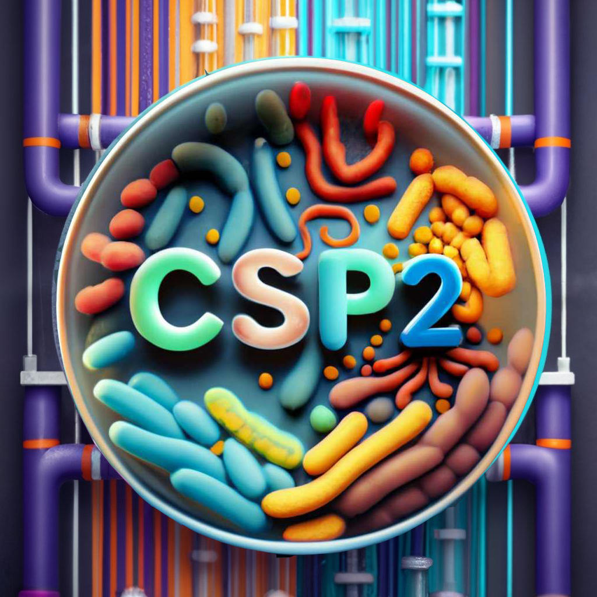
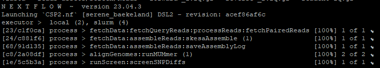

<p align="center">
  
</p>

# CFSAN SNP Pipeline 2 (CSP2)  
#### Dr. Robert Literman
**Office of Analytics and Outreach**  
**Center for Food Safety and Applied Nutrition**  
**US Food and Drug Administration**  
  
**Current Release**: [v.0.9.0 (Dec-20-2023)](https://github.com/CFSAN-Biostatistics/CSP2/releases/tag/v.0.9.0)  
**Last Push**: Dec-20-2023  

**Important Note:** *CSP2 is currently under development, and has not been validated for non-research purposes. Current workflows and data processing parameters may change prior to full release version.*

## CSP2 is a Nextflow pipeline for rapid, accurate SNP distance estimation from assembly data  

CSP2 runs on Unix, with the handful of dependencies listed in the [Software Dependencies](#software-dependencies) section. CSP2 was developed to **(1)** improve on the speed of the [CFSAN SNP Pipeline (CSP)](https://peerj.com/articles/cs-20/?report=reader), **(2)** to reduce computational burden when analyzing larger isolate clusters, and **(3)** to remove the dependency for raw Illumina data. CSP2 relies on the accurate and rapid alignment of genome assemblies provided by [MUmmer](https://github.com/mummer4/mummer), which typically complete within seconds. This provides significant reductions in runtime compared to methods that rely on read mapping. The use of assemblies in place of sequencing data also means that:  

- the amount storage needed can be substantially reduced, 
- significantly less computational resources are required, 
- as long as assemblies are available, isolates can be compared regardless of sequencing platform or whether publicly available sequence data even exists   

CSP2 runs are managed via Nextflow, providing the user with an array of [customizations](#tips-for-configuring-csp2) while also facilitating module development and additions in future releases. 

**Important Note**: *The software continues to be focused on the analysis of groups of bacterial genomes with limited evolutionary differences (<1000 SNPs). Testing is underway to determine how the underlying cluster diversity impacts distances estimates.*

### CSP2 has two main run modes (See [Examples](#examples)):  

#### 1) "Screening Mode" (*--runmode screen*):  Used to determine whether query isolates are close to a set of reference isolates (e.g., lab control strains, strains related to an outbreak, etc.)    
Given one or more user-provided reference isolates (*--ref_reads*; *--ref_fasta*), get alignment statistics and SNP distances between all reference and query isolates (*--reads*; *--fasta*)
   
#### 2) "SNP Pipeline Mode" (*--runmode snp*): Used to generate pairwise distances and alignments for a set of query isolates
Generate pairwise SNP distances and alignments for 2+ isolates (*--reads*; *--fasta*) based on comparisons to:  
- One or more user-provided references (*--ref_reads*; *--ref_fasta*), or  
- One or more reference isolates selected by RefChooser (*--n_ref*)

All CSP2 sequence comparisons happen at the assembly level, but if reads are provided CSP2 will perform a genome assembly using *SKESA*. In either case, CSP2 then calls MUMmer for alignment. If a sufficient portion of the reference genome is aligned (*--min_cov*), that data is passed through a set of filters that largely mimic those from the CFSAN SNP Pipeline, including the automated removal of:  
- Sites from short alignments (*--min_len*)  
- Sites from poorly aligned contigs (*--min_iden*)
- Sites close to the contig edge (*--query_edge*/*--ref_edge*)
- Sites from regions of high SNP density (*--dwin*/*--wsnps*)
- Multiply aligned sites
- Non-base sites (e.g., 'N' or '?')
- Heterozygous sites
- Indels (**for now**)

This final dataset is summarized into a *.snpdiffs* file, which contains:  
1. A one-line header with alignment statistics  
2. A BED file of contig mappings that pass QC  
3. Information about SNPs (if present)

To avoid unnecessary realignment, once a .snpdiffs file is generated under a particular set of QC parameters (which is hardcoded into the .snpdiffs file as the "QC_String") these files can be used in other CSP2 runs via the *--snpdiffs* argument (if using the same QC parameters). 

---

## Software Dependencies  
The following software are required to run CSP2. Software version used during CSP2 development noted in parentheses.  

- [Nextflow](https://www.nextflow.io/docs/latest/getstarted.html) (22.10.7)  
- [Python](https://www.python.org/downloads/) (3.8.1)  
  - [pybedtools](https://pypi.org/project/pybedtools/)
- [BEDTools](https://bedtools.readthedocs.io/en/latest/) (2.26.0)  
- [MUmmer](https://github.com/mummer4/mummer) (4.0.0)  
- [SKESA](https://github.com/ncbi/SKESA) (2.5.0) [Only required if starting from raw reads]  
  
---
## Installing CSP2 
CSP2 can be installed by cloning the GitHub repo and configuring the [nextflow.config](nextflow.config) and [profiles.config](conf/profiles.config) to suit your needs  

```
git clone https://github.com/CFSAN-Biostatistics/CSP2.git
```

## Tips for configuring CSP2  
CSP2 options can be specified on the command line, or through the Nextflow configuration files detailed in the next section. Feel free to skip this section if you're familiar with editing Nextflow configuration files.  

There are two main configuration files associated with CSP2:  

- The profiles.config file is where you add custom information about your computing environment, but you can also set parameters here as well. An example configuration setup (slurmHPC) is provided as a model.  
  
- In this example profile, access to the required programs relies on the loading of modules. **However**, there is no need to specify a module for Python, MUMmer, SKESA, bedtools, or RefChooser if those programs are already in your path. 

```
profiles {
    standard {
        process.executor = 'local'
        params.cores = 1
        params.python_module = ""
        params.mummer_module = ""
        params.skesa_module = ""
        params.bedtools_module = ""
        params.refchooser_module = ""
    }
    slurmHPC {
        process.executor = 'slurm'
        params.cores = 20
        params.python_module = "python/3.8.1"
        params.mummer_module = "mummer/4.0.0"
        params.skesa_module = "skesa/2.5.0"
        params.bedtools_module = "bedtools"
        params.refchooser_module = "refchooser/0.2.1"
    }
}
```
- If you add your own profile, be sure to note it on the command line (one hypen)
```
nextflow run CSP2.nf -profile myNewProfile <args>
```
 
- The nextflow.config file is where you can change other aspects of the CSP2 run, including data location, QC parameters, and all the options listed below:

**Options with defaults include**:  

| Parameter        | Description                                                                                                | Default Value                             |
|------------------|------------------------------------------------------------------------------------------------------------|-------------------------------------------|
| --outroot        | Base directory to create output folder                                                       				| $CWD 								        |
| --out            | Name of the output folder to create (must not exist)                                                       | CSP2_${new java.util.Date().getTime()}    |
| --forward        | Full file extension for forward/left reads of query                                                        | _1.fastq.gz                               |
| --reverse        | Full file extension for reverse/right reads of reference                                                   | _2.fastq.gz                               |
| --ref_forward    | Full file extension for forward/left reads of reference                                                    | _1.fastq.gz                               |
| --ref_reverse    | Full file extension for reverse/right reads of reference                                                   | _2.fastq.gz                               |
| --readext        | Extension for single-end reads for query                                                                   | fastq.gz                                  |
| --ref_readext    | Extension for single-end reads for reference                                                               | fastq.gz                                  |
| --min_cov        | Do not analyze queries that cover less than <min_cov>% of the reference assembly                           | 85                                        |
| --min_iden       | Only consider alignments where the percent identity is at least <min_iden>%                                | 99                                        |
| --min_len        | Only consider alignments that span at least <min_len>bp                                                    | 500                                       |
| --dwin           | A comma-separated list of windows to check SNP densities                                                   | 1000,125,15                               |
| --wsnps          | The maximum number of SNPs allowed in the corresponding window from --dwin                                 | 3,2,1                                     |
| --query_edge     | Only consider SNPs that occur within <query_edge>bp of the end of a query contig                           | 250                                       |
| --ref_edge       | Only consider SNPs that occur within <query_edge>bp of the end of a reference contig                       | 250                                       |
| --n_ref          | The number of RefChooser reference isolates to consider (only applied if using RefChooser)                 | 1                                         |

**Options without defaults include**:  
| Parameter              | Description                                                                                                          |
|------------------------|----------------------------------------------------------------------------------------------------------------------|
| --reads                | Location of query read data (Path to directory, or path to file with multiple directories)                           |
| --fasta                | Location of query assembly data (Path to directory containing FASTAs, path to FASTA, path to multiple FASTAs)        |
| --ref_reads            | Location of reference read data (Path to directory, or path to file with multiple directories)                       |
| --ref_fasta            | Location of reference assembly data (Path to directory containing FASTAs, path to FASTA, path to multiple FASTAs)    |
| --python_module        | Name of Python module if 'module load PYTHON' statement is required.                                                 |
| --mummer_module        | Name of MUmmer module if 'module load MUMMER' statement is required.                                                 |
| --skesa_module         | Name of SKESA module if 'module load SKESA' statement is required.                                                   |
| --refchooser_module    | Name of RefChooser module if 'module load REFCHOOSER' statement is required.                                         |
| --bedtools_module      | Name of BEDTools module if 'module load BEDTOOLS' statement is required.                                             |
| --trim_name            | A string in assembly file names that you want to remove from sample IDs (e.g., _contigs_skesa)                       |

---

## Examples

The repo contains small test datasets to ensure things are running as expected. Here are a few examples of how you can use CSP2 in screening mode or in SNP pipeline mode. 

## Screening Mode (Example)
*Situation*: As part of a long-term microbiology experiment, you perform weekly WGS sequencing on isolates as they evolve under different selective conditions. As results, your DNA sequencing facility returns raw WGS reads and assembled genomes. 

During Week 42, analyses start detecting high numbers of mutations, and assembly-based results are not concordant with read-based results. You suspect that either the reads or assembly you were given may be from their lab control strain, but you want to check first.  

**The data**:  
  - Read data  
    - Week_42_Reads_1.fq.gz; Week_42_Reads_2.fq.gz  
  - Assembled data:  
    - Week_42_Assembly.fa  
    - Lab_Control.fasta  

  In this case, we want to use *--runmode screen*, because we want to explicitly check if either dataset matches the reference strain.  

  - **Note**: By default, CSP2 expects read data as zipped fastqs (fastq.gz), with paired-end reads denoted as _1.fastq.gz and _2.fastg.gz. These settings can be changed: 
    - Permanently in the nextflow.config file
    - Situationally in profiles.config 
    - Directly on the command line, as in the example below:
      - **Query Reads**: *--readext*; *--forward*; *--reverse*  
      - **Reference Reads**: *--ref_readext*; *--ref_forward*; *--ref_reverse*

To run this example locally, where *Nextflow*, *SKESA*, *MUMmer*, *Python*, and *BEDTools* are installed on your path, run:  

```
nextflow run CSP2.nf --out Test_Output/Contamination_Screen --runmode screen --ref_fasta assets/Screen/Assembly/Lab_Control.fasta --fasta assets/Screen/Assembly/Week_42_Assembly.fasta --reads assets/Screen/Reads --forward _1.fq.gz --reverse _2.fq.gz --readext fq.gz
```

```
nextflow run CSP2.nf                                    // Run CSP2  
--out Test_Output/Contamination_Screen                  // Save results to ./Test_Output/Contamination_Screen  
--runmode screen                                        // Compare each query to the reference
--ref_fasta assets/Screen/Assembly/Lab_Control.fasta    // Compare all queries to this reference  
--fasta assets/Screen/Assembly/Week_42_Assembly.fasta   // Include this assembly as a query
--reads assets/Screen/Reads                             // Include any read datasets from this directory as queries
--forward _1.fq.gz                                      // Forward reads don't match the default '_1.fastq.gz'
--reverse _2.fq.gz                                      // Reverse reads don't match the default '_2.fastq.gz'
--readext fq.gz                                         // Reads don't match the default 'fastq.gz'
```

If you're running on an HPC and you need to load modules, you could include your custom profile:  

```
# Load Nextflow module if necessary
module load nextflow

nextflow run CSP2.nf -profile slurmHPC --out Test_Output/Contamination_Screen --runmode screen --ref_fasta assets/Screen/Assembly/Lab_Control.fasta --fasta assets/Screen/Assembly/Week_42_Assembly.fasta --reads assets/Screen/Reads --forward _1.fq.gz --reverse _2.fq.gz --readext fq.gz
```
```
nextflow run CSP2.nf                                    // Run CSP2  
-profile slurmHPC                                       // Choose run profile (**note single hyphen**)
--out Test_Output/Contamination_Screen                  // Save results to ./Test_Output/Contamination_Screen  
--runmode screen                                        // Compare each query to the reference
--ref_fasta assets/Screen/Assembly/Lab_Control.fasta    // Compare all queries to this reference  
--fasta assets/Screen/Assembly/Week_42_Assembly.fasta   // Include this assembly as a query
--reads assets/Screen/Reads                             // Include any read datasets from this directory as queries
--forward _1.fq.gz                                      // Forward reads don't match the default '_1.fastq.gz'
--reverse _2.fq.gz                                      // Reverse reads don't match the default '_2.fastq.gz'
--readext fq.gz                                         // Reads don't match the default 'fastq.gz'
```

### Output

If all went well, you should see something like this:
<p align="center">
  
</p>

From top to bottom, we can see that CSP2:  
- Found the paired-end reads
- Assembled them using *SKESA*
- Saved an assembly log
- Aligned both queries against the reference using MUMmer
- Ran the screening script to generate the output table

Let's take a look to see what was generated:
```
ls Test_Output/Contamination_Screen

Assemblies/
logs/           
MUMmer_Output/
Query_Isolates.tsv      
Reference_Isolates.tsv
Screening_Results_PassQC.tsv
snpdiffs/

```
-**Note**: This output is available to inspect in [assets/Screen/Output](assets/Screen/Output)  

**Directories**  

  - *Assemblies*: Directory where any *SKESA* assemblies are stored  
  - *logs*: Directory where run logs are stored  
  - *MUMmer_Output*: Directory where raw MUMmer .snps, .report, .1coords are stored  
  - *snpdiffs*: Directory where .snpdiffs files are stored
  
**Files**
  - *Query_Isolates.tsv*: A TSV file with basic FASTA stats for each query isolate

    | Query_ID         | Query_Assembly                                                  | Query_SHA256                                                     | Query_Contig_Count | Query_Assembly_Bases |
    |------------------|-----------------------------------------------------------------|------------------------------------------------------------------|--------------------|----------------------|
    | Week_42_Assembly | assets/Screen/Assembly/Week_42_Assembly.fasta                   | 85c216de6e1bb9ccf76e7e5d64931884375d66e765f4c4fe726f3be15eb91563 | 747                | 4473771              |
    | Week_42_Reads    | Test_Output/Contamination_Screen/Assemblies/Week_42_Reads.fasta | 28eca0ecf14fcc1166ae7236c849acc08ad040cd011fc4331ba124db73601009 | 372                | 4561747              |

  - *Reference_Isolates.tsv*: A TSV file with basic FASTA stats for each reference isolate  

    | Reference_ID | Reference_Assembly                       | Reference_SHA256                                                 | Reference_Contig_Count | Reference_Assembly_Bases |
    |--------------|------------------------------------------|------------------------------------------------------------------|------------------------|--------------------------|
    | Lab_Control  | assets/Screen/Assembly/Lab_Control.fasta | aae3a07d055bff2fa66127ca77cae35dd5cce5cc42dafea481787d4010c7dbef | 254                    | 4584986                  |

- *Screening_Results_PassQC.tsv*: A TSV file with screening results for all queries that made it through QC  

  | Query_ID         | Reference_ID | SNPs | Percent_Query_Aligned | Percent_Reference_Aligned | Median_Percent_Identity | Median_SNP_Percent_Identity | Purged_Alignment | Purged_N | Purged_Indel | Purged_Duplicate | Purged_Het | Purged_Density | Filtered_Edge |
  |------------------|--------------|------|-----------------------|---------------------------|-------------------------|-----------------------------|------------------|----------|--------------|------------------|------------|----------------|---------------|
  | Week_42_Assembly | Lab_Control  | 1    | 99.97                 | 97.55                     | 100.00                  | 99.99                       | 0                | 0        | 0            | 0                | 0          | 0              | 0             |
  | Week_42_Reads    | Lab_Control  | 49   | 99.55                 | 99.04                     | 100.00                  | 99.99                       | 11               | 0        | 2            | 0                | 0          | 0              | 3             |

  - **Note:** There will be a separate file for any queries that fail QC, along with some indication as to why they failed (*Screening_Results_FailQC.tsv*)  
  - **Columns**  
    - **SNPs**: The SNP distance between the query and reference assemblies  
    - **Percent_(Query/Reference)_Aligned**: The percent of bases from the (query/reference) genome involved in an 1-to-1 alignment that passed QC  
    - **Median_Percent_Identity**: The median percent identity of all 1-to-1 alignments  
    - **Median_SNP_Percent_Identity**: The median percent identity of 1-to-1 alignments containing SNPs  
    - **Purged_Alignment**: Count of MUMmer SNPs removed due to falling on short alignments (*--min_len*) or contigs with low similarity (*--min_iden*)
    - **Purged_N**: Count of MUMmer SNPs removed due to presence of a non-ACTG base  
    - **Purged_Indel**: Count of MUMmer indel SNPs removed  
    - **Purged_Duplicate**: Count of MUMmer SNPs removed due to duplicated mapping to the same region (the SNP from the longest contig is retained unless there is heterozygosity)  
    - **Purged_Het**: Count of MUMmer SNPs removed due multiple alignments with multiple bases  
    - **Purged_Density**: Count of MUMmer SNPs removed due to having too many SNPs (*--wsnps*) within prescribed windows (*--dwin*)
    - **Filtered_Edge**: Count of MUMmer SNPs removed due to falling too near the edge of the contig in the query (*--query_edge*) or reference (*--ref_edge*) 
- SNPDiffs Files  
  - The .snpdiffs files generated by CSP2 have three main components:  
    1. **Header**: The header row of a .snpdiffs file contains all the same information as the screening results TSV.  
         - To peek at a .snpdiffs header, try:
           ```
           head -1 (QUERY)__vs__(REF).snpdiffs | tr "\t" "\n"
           ```
    2. **BED File**: Assuming sufficient overlap in assemblies, the next section will be a BED file of all the 1-to-1 overlaps between the query and reference that passed QC. This section is denoted by '##\t'  
   
        ```
        grep "##" Week_42_Reads__vs__Lab_Control.snpdiffs | head -10

        ##      SRR16119110_100_32.8137 1       6519
        ##      SRR16119110_100_32.8137 6587    7524
        ##      SRR16119110_100_32.8137 7829    36104
        ##      SRR16119110_102_54.229  226     12863
        ##      SRR16119110_103_30.5388 144     6585
        ##      SRR16119110_104_40.3209 1       12590
        ##      SRR16119110_104_40.3209 12665   19615
        ##      SRR16119110_105_32.917  34      11125
        ##      SRR16119110_106_22.2235 1       2959
        ##      SRR16119110_107_44.0162 140     12900
        ```
    3. **SNP Data**: Finally, the third section of a .snpdiffs file contains all the data on SNPs that passed and failed QC. Only SNPs with the Category "SNP" are counted in the final distance. The columns headers are: 
    - **Reference_Contig/Position**, **SNP_Category**, **Reference_Base**, **Query_Base**, **Query_Contig/Position**, **Alignment_Length**, **Percent_Identity**

      ```
      grep -v "#" Week_42_Reads__vs__Lab_Control.snpdiffs | head -10

      SRR16119110_107_44.0162/199487  Purged_Indel    C       .       Contig_93_15.202/78689  84047   99.99
      SRR16119110_107_44.0162/199488  Purged_Indel    G       .       Contig_93_15.202/78689  84047   99.99
      SRR16119110_135_26.5159/2371    Filtered_Edge   G       A       Contig_215_11.8373/2371 2511    99.96
      SRR16119110_169_34.8837/29667   Filtered_Edge   C       T       Contig_343_14.7634/29737        29908   99.99
      SRR16119110_68_27.0865/4663     Filtered_Edge   T       G       Contig_87_14.297/4      2865    99.97
      SRR16119110_107_44.0162/79354   SNP     A       T       Contig_138_15.1806/38295        75647   99.99
      SRR16119110_107_44.0162/96798   SNP     C       T       Contig_138_15.1806/55739        75647   99.99
      SRR16119110_107_44.0162/105822  SNP     G       A       Contig_138_15.1806/64763        75647   99.99
      SRR16119110_107_44.0162/170609  SNP     G       A       Contig_93_15.202/49812  84047   99.99
      SRR16119110_107_44.0162/183056  SNP     C       T       Contig_93_15.202/62259  84047   99.99
      ```
  **Conclusions**
  
  Based on these results, the assembly provided by the DNA sequencing facility had only 1 SNP relative to the lab control strain, but the read data was over 40 SNPs away, suggesting that the wrong assembly was packaged with the read data.  

## SNP Pipeline Mode (Example)
*Situation*: You dug 10 soil samples and isolated a single microbe from each. You want to check the relatedness of the cultured isolates.

The data:  
  - Assemblies from soil isolates (Sample_(A-O).fasta)

In this case, we want to use *--runmode snp*, because we want to calculate the pairwise distances between all isolates and generate alignments. We will let RefChooser choose the best reference genome.

```
nextflow run CSP2.nf --out Test_Output/Soil_Analysis --runmode snp --fasta assets/SNP/

nextflow run CSP2.nf              // Run CSP2  
--out Test_Output/Soil_Analysis   // Save results to ./Test_Output/Soil_Analysis  
--runmode snp                     // Compare all queries to each other
--fasta assets/SNP                // Gather query assemblies from this directory
```
### Output

If all went well, you should see something like this:
<p align="center">
  
</p>

From top to bottom, we can see that CSP2:  
- Skipped assembly steps, as queries were already assembled
- Ran *RefChooser* to choose a suitable reference genome
- Aligned each query to the reference using MUMmer
- Ran the SNP pipeline workflow on the .snpdiffs files to generate alignments and SNP distance data  

Let's take a look to see what was generated:
```
ls Test_Output/Soil_Analysis

logs/
MUMmer_Output/
snpdiffs/
SNP_Sample_A
```
-**Note**: This output is available to inspect in [assets/SNP/Output](assets/SNP/Output)  

**Directories**  
  - *logs*: Directory where run logs are stored  
  - *MUMmer_Output*: Directory where raw MUMmer .snps, .report, .1coords are stored  
  - *snpdiffs*: Directory where .snpdiffs files are stored
  - *SNP_Sample_A*: Directory where SNP pipeline results using Sample_A as a reference are stored
  
**Files**
 
 - The log file for any SNP pipeline run contains lots of useful information, including runtimes and output locations.

    ```
    cat logs/SNP_Sample_A.log

    -------------------------------------------------------
    SNP Analysis
    Reference Isolate: Sample_A
    2023-12-18 13:49:19
    -------------------------------------------------------

    Step 1: Reading in .snpdiffs files...Done!
            - Found 14 .snpdiffs files
            - Processed 14 .snpdiffs files in 0.37s

    -------------------------------------------------------

    Step 2: Performing sanity checks...Done!

    -------------------------------------------------------

    Step 3: Removing alignments that failed QC...Done!
            - 14 alignments passed QC

    -------------------------------------------------------

    Step 4: Collecting SNPs from all queries...Done!
            - 163 SNPs detected

    -------------------------------------------------------

    Step 5: Processing purged loci...Done!  - No purged sites to process...

    -------------------------------------------------------

    Step 6: Creating BED file for all SNP loci...Done! (0.06s)

    -------------------------------------------------------

    Step 7: Looking for SNP loci that are not covered in any query...Done! (0.17s)
            - Queries lacked alignment coverage for 8 total sites

    -------------------------------------------------------

    Step 8: Looking for SNP loci that have the reference base in some queries...Done! (0.05s)
            - Queries had the reference base for for 1992 total sites

    -------------------------------------------------------

    Step 9: Compiling data and checking SNP counts...Done!
            - Saved locus category data to Test_Output/Soil_Analysis/SNP_Sample_A/Locus_Categories.tsv
            - Saved isolate data to Test_Output/Soil_Analysis/SNP_Sample_A/Isolate_Data.tsv

    -------------------------------------------------------

    Step 10: Processing alignment data...Done!
            - Created alignment(s) in 0.18s
            - Saved alignment to Test_Output/Soil_Analysis/SNP_Sample_A/snp_alignment.fasta
            - Saved ordered list of loci to Test_Output/Soil_Analysis/SNP_Sample_A/Loc_List.txt
            - Identified no sites to prune.
                    - Saved original alignment to Test_Output/Soil_Analysis/SNP_Sample_A/pruned_snp_alignment.fasta
                    - Saved original ordered list of pruned loci to Test_Output/Soil_Analysis/SNP_Sample_A/Pruned_Loc_List.txt

    -------------------------------------------------------

    Step 11: Processing pairwise comparisons files...Done!
            - Calculated 105 pairwise distances in 0.24s
            - Saved pairwise distance data to Test_Output/Soil_Analysis/SNP_Sample_A/distance_pairwise.tsv
            - Saved distance matrix to Test_Output/Soil_Analysis/SNP_Sample_A/distance_matrix.tsv
                    - No sites pruned, saved original pairwise distance data to Test_Output/Soil_Analysis/SNP_Sample_A/pruned_distance_pairwise.tsv
                    - No sites pruned, saved original distance matrix to Test_Output/Soil_Analysis/SNP_Sample_A/pruned_distance_matrix.tsv

    -------------------------------------------------------

    Total Runtime: 1.32s

    ```

- For each reference sample there will be a folder called SNP_*Reference_ID*, containing:  

  - *Isolate_Data.tsv*: A TSV file containing the alignment information for each query, along with data about the reference isolate
  - *Locus_Categories.tsv*: A TSV file containing information about each SNP and how many isolates had missing or purged data
  - *snp_alignment.fasta*: A FASTA alignment of SNPs
  - *Loc_List.txt*: The ordered list of locs (Reference Contig/Position) of SNPs corresponding to *snp_alignment.fasta*
  - *distance_matrix.tsv*: A distance matrix for all queries that passed QC
  - *distance_pairwise.tsv*: A TSV file containing Query_1,Query_2,SNP_Distance,Cocalled_Sites

- There is a pruning step that removes any SNPs where > 2/3 isolates have missing data, resulting in: 

  - *pruned_snp_alignment.fasta*: A FASTA alignment of SNPs after pruning  
  - *Pruned_Loc_List.txt*: The ordered list of locs (Reference Contig/Position) of SNPs corresponding to *pruned_snp_alignment.fasta*   
  - *pruned_distance_matrix.tsv*: A distance matrix for all queries that passed QC after pruning  
  - *pruned_distance_pairwise.tsv*: A TSV file containing Query_1,Query_2,SNP_Distance,Cocalled_Sites after pruning  

Let's check out our isolate data:  
```
cat Test_Output/Soil_Analysis/SNP_Sample_A/Isolate_Data.tsv
```
| Isolate_ID | Assembly                  | Contig_Count | Assembly_Bases | SHA256                                                           | Category          | Percent_Reference_Aligned | Percent_Query_Aligned | SNPs | Purged_Alignment | Purged_N | Purged_Het | Purged_Indel | Purged_Density | Filtered_Edge |
|------------|---------------------------|--------------|----------------|------------------------------------------------------------------|-------------------|---------------------------|-----------------------|------|------------------|----------|------------|--------------|----------------|---------------|
| Sample_D   | assets/SNP/Sample_D.fasta | 55           | 4627990        | 0a8824d9ecda9632b817d421c082e8bf87b613a8032e6e41ce02fb8a8167d8c0 | PASS              | 99.97                     | 99.93                 | 10   | 0                | 0        | 0          | 9            | 0              | 0             |
| Sample_F   | assets/SNP/Sample_F.fasta | 275          | 4582721        | 1f9e26d3f5ea00ac336292f5877077fcf74f8fbfa13c7e64c594f9808fd392ef | PASS              | 99.04                     | 99.98                 | 28   | 0                | 0        | 0          | 1            | 0              | 1             |
| Sample_H   | assets/SNP/Sample_H.fasta | 54           | 4728796        | 7f3d73397edee903cfea5b796e4f1a257cc50b63233dcb68a5379ec4fad22953 | PASS              | 99.97                     | 97.81                 | 25   | 0                | 0        | 0          | 1            | 0              | 0             |
| Sample_E   | assets/SNP/Sample_E.fasta | 84           | 4624417        | 342f8303aafabca5c3e3f175b975cab322eb91fa1f0aabb72340f07bd4740623 | PASS              | 99.93                     | 99.97                 | 10   | 0                | 0        | 0          | 3            | 0              | 0             |
| Sample_C   | assets/SNP/Sample_C.fasta | 49           | 4668385        | c4676142f6ab101d74ffea7d9315433ccaacee08df481f019cdc2cf29969f52b | PASS              | 99.98                     | 99.08                 | 18   | 0                | 0        | 0          | 1            | 0              | 0             |
| Sample_B   | assets/SNP/Sample_B.fasta | 40           | 4631086        | 2486ab6c17c1c7997a5707111aa8e2cac41c578382aff413fa66086a31fbde38 | PASS              | 99.99                     | 99.88                 | 31   | 0                | 0        | 0          | 1            | 2              | 4             |
| Sample_K   | assets/SNP/Sample_K.fasta | 38           | 4632444        | eb45e2ad3c47422df1d3bb56c8900d89daf2e623e00389a94d77f2099e6288ff | PASS              | 99.95                     | 99.82                 | 15   | 0                | 0        | 0          | 14           | 0              | 0             |
| Sample_I   | assets/SNP/Sample_I.fasta | 47           | 4668267        | e05093575566fd4d00f1e50534435fc38b757b0f26ff73c3046ac9f436fd6208 | PASS              | 99.97                     | 99.07                 | 12   | 0                | 0        | 0          | 2            | 0              | 0             |
| Sample_M   | assets/SNP/Sample_M.fasta | 805          | 4587464        | 43cb745a1d68479c4c5478bc92d6dbe3c8c999be665ce6394243b7b659a7fa1f | PASS              | 98.14                     | 98.97                 | 27   | 0                | 0        | 0          | 1            | 0              | 2             |
| Sample_L   | assets/SNP/Sample_L.fasta | 61           | 4627094        | c0c473f21eb8c605b2bd77299e5cbff8d7e6944d62937f0202efb6425f7a1f2c | PASS              | 99.94                     | 99.93                 | 9    | 0                | 0        | 0          | 3            | 0              | 0             |
| Sample_G   | assets/SNP/Sample_G.fasta | 254          | 4584986        | aae3a07d055bff2fa66127ca77cae35dd5cce5cc42dafea481787d4010c7dbef | PASS              | 99.07                     | 99.97                 | 29   | 0                | 0        | 0          | 1            | 0              | 1             |
| Sample_O   | assets/SNP/Sample_O.fasta | 83           | 4623444        | cbcc76d3c8bd2e8c61daeb1abeeab82b5f6285b1b52ec3211252fe8fa721df78 | PASS              | 99.87                     | 99.93                 | 34   | 0                | 0        | 0          | 15           | 3              | 0             |
| Sample_J   | assets/SNP/Sample_J.fasta | 170          | 4730789        | f4b68669533ce36a0f19f97ed11ffa0ea40daa27767f9b094cca7d4ffff53225 | PASS              | 99.58                     | 97.38                 | 17   | 0                | 0        | 0          | 1            | 0              | 0             |
| Sample_N   | assets/SNP/Sample_N.fasta | 63           | 4667287        | d32b34cc2dd9824e5381b505505ff44d510d4e9d5e7352eab60ec2878d3a688b | PASS              | 99.95                     | 99.07                 | 17   | 0                | 0        | 0          | 1            | 0              | 0             |
| Sample_A   | assets/SNP/Sample_A.fasta | 50           | 4626313        | dae2379030db9c465040198216d2976ef11fcea1a5739c2dc47950253842bd4b | Reference_Isolate |                           |                       |      |                  |          |            |              |                |               |

Everything seems to have aligned well, so let's check the SNP distances for our samples:

```
cat pruned_distance_matrix.tsv
```

|          | Sample_A | Sample_B | Sample_C | Sample_D | Sample_E | Sample_F | Sample_G | Sample_H | Sample_I | Sample_J | Sample_K | Sample_L | Sample_M | Sample_N | Sample_O |
|----------|----------|----------|----------|----------|----------|----------|----------|----------|----------|----------|----------|----------|----------|----------|----------|
| Sample_A | 0        | 31       | 18       | 10       | 10       | 28       | 29       | 25       | 12       | 17       | 15       | 9        | 27       | 17       | 34       |
| Sample_B | 31       | 0        | 39       | 31       | 31       | 49       | 50       | 48       | 33       | 38       | 36       | 36       | 50       | 38       | 27       |
| Sample_C | 18       | 39       | 0        | 18       | 18       | 35       | 35       | 35       | 14       | 24       | 23       | 23       | 36       | 7        | 42       |
| Sample_D | 10       | 31       | 18       | 0        | 0        | 28       | 29       | 27       | 12       | 17       | 15       | 15       | 29       | 17       | 34       |
| Sample_E | 10       | 31       | 18       | 0        | 0        | 28       | 29       | 27       | 12       | 17       | 15       | 15       | 29       | 17       | 34       |
| Sample_F | 28       | 49       | 35       | 28       | 28       | 0        | 3        | 45       | 29       | 32       | 30       | 33       | 46       | 34       | 52       |
| Sample_G | 29       | 50       | 35       | 29       | 29       | 3        | 0        | 46       | 30       | 33       | 31       | 34       | 47       | 35       | 53       |
| Sample_H | 25       | 48       | 35       | 27       | 27       | 45       | 46       | 0        | 29       | 34       | 32       | 30       | 44       | 34       | 51       |
| Sample_I | 12       | 33       | 14       | 12       | 12       | 29       | 30       | 29       | 0        | 18       | 17       | 17       | 30       | 13       | 36       |
| Sample_J | 17       | 38       | 24       | 17       | 17       | 32       | 33       | 34       | 18       | 0        | 12       | 22       | 36       | 23       | 41       |
| Sample_K | 15       | 36       | 23       | 15       | 15       | 30       | 31       | 32       | 17       | 12       | 0        | 20       | 34       | 22       | 39       |
| Sample_L | 9        | 36       | 23       | 15       | 15       | 33       | 34       | 30       | 17       | 22       | 20       | 0        | 32       | 22       | 39       |
| Sample_M | 27       | 50       | 36       | 29       | 29       | 46       | 47       | 44       | 30       | 36       | 34       | 32       | 0        | 35       | 53       |
| Sample_N | 17       | 38       | 7        | 17       | 17       | 34       | 35       | 34       | 13       | 23       | 22       | 22       | 35       | 0        | 41       |
| Sample_O | 34       | 27       | 42       | 34       | 34       | 52       | 53       | 51       | 36       | 41       | 39       | 39       | 53       | 41       | 0        |

And the alignment:
```
cat pruned_snp_alignment.fasta

>Sample_A
TAAGCCTGCACCGCGGCGGCGATCGGACAAGCGACGAGTACCACTCGCCTCGTCGGCGAC
AACGTACCGCGCACACTTTAAGGCGCGGCAAGCGATGCGTTGTGCTTACGAGGGCTTTCG
GACGTTACCCTTTTGAGCCGACCAGGGAGCCGGCGTGATAGCT
>Sample_B
TAAGCCTGCATCACGACGACAATTGGACATGCGGCCAGCACCGTCTGCCGCGACGGCAAC
AACATACCGCACACACTTTAAGGAGCGGCACGCGATGCGTCGTACTCACGAGGGCTTTAG
GACGTGACCCTTTTGAGCCACCCAGGGAGCCGCCGTGAGAGCC
>Sample_C
TAATCTTACACCACGGCGGCGATCGTACAAGCGACGAGCACCACTCGCCGCGTCGGCAAC
AAAGTAAAGCGCACACTTTCAGGCGCGGCAAGCGATGCATTGTGCTTACGAGGGCTTTCG
GACGTTACCCTTCTGAGTTGACCAGGGAGCCGGCGTGATATCC
>Sample_D
TAAGCCTGCACCACGGCGGCGATCGGACAAGCGACGAGCACCACTCGCCGCGTCTGCAAC
AACGTACCGCGCACACTTTAAGGCGCGGCAAGCGATGCGTTATGCTTACGAGGGCTTTCG
GACGCTATCCTTTTGAGCCGACCAGGGAGTCGGCGTGATAGCC
>Sample_E
TAAGCCTGCACCACGGCGGCGATCGGACAAGCGACGAGCACCACTCGCCGCGTCTGCAAC
AACGTACCGCGCACACTTTAAGGCGCGGCAAGCGATGCGTTATGCTTACGAGGGCTTTCG
GACGCTATCCTTTTGAGCCGACCAGGGAGTCGGCGTGATAGCC
>Sample_F
TACGCCTGTACTACGGCGGTGAACGGGCAAGCGACGGGCGCTACTCGCTGTATCGGCAAC
AGNGTACCGCGCNTATTTTAAGGCGCGGCAAGCGATGTGTTGCGCTTACGAAAGCTTTCG
GGCGTTACCCTTTTGCGCCGACCGGGGAGCCGGAGTGATAGCC
>Sample_G
TACGCCTGTGCTACGGCGGTGAACGGGCAAGCGACGGGCGCTACTCGCTGTATCGGCAAC
AANGTACCGCGCNTATTTTAAGGCGCGGCAAGCGATGTGCTGCGCTTACGAAAGCTTTCG
GGCGTTACCCTTTTGCGCCGACCGGGGAGCCGGAGTGATANCC
>Sample_H
TAAGCCTGCACCATCGGGGCGATCGGACAAGCGACGAGCACCACTCGCCTCGTCGGCAAC
AACGTACCGCGCACACTTAAGGCCGCGGCAACCCATGCGTTGTGCATACCAGGGCTCCCG
GAGGTTACTTTTTGCATCCGACCATCGAGCCGGCGTTATAGCC
>Sample_I
TAATCCTACACCACGGCGGCGATCGGACAAGCGACGAGCACCACTCGCCGCGTCGGCAAC
AAAGTACCGCGCACACTTTAAGGCACGGCGAGCGATGCGTTGTGCTTACGAGGGCTTTCG
AACGTTACCCTTTTGAGCCGACCAGGAAGCCGGCGTGATAGCC
>Sample_J
TAAGCCTGCACCACGGCAGCGATCGGACCAGCGACGAGCGCCACTCGCCGCGTCGGCAAC
AANGTACCGCGCGCGCTCTAAGGCGCGGCAAGCGATTCGTTGTGCTTACGAGGGTCTTCG
GACATTACCCTTTTGAGCCGATCAGGGAGCCGGCGTGTTAGCC
>Sample_K
TAAGACTGCACCACGGCGGCGATCGGACCAGCTAGGAGCGCCACTCGCCGCGTCGGCAAC
AACGTACCGAGCGCACTTTAAGGCGCGGCAAGCGATTCGTTGTGCTTACGAGGGCTTTCG
GACGTTACCCTTTTGAGCCGATCAGGGGGCCGGCGTGATAGCC
>Sample_L
TAAGCCCGCACCGCGGCGGCGATCGGACAAGCGACGAATACCACTCATCTCGTCGGCAAC
AACGTACCGCGCACACTTTAAGGCGCAGCAAGCGATGCGTTGTGTTTACGAGGGCTTTCA
GACGTTACCCTTTTGAGCCGACCAGGGAGCCGGCGTGATAGCC
>Sample_M
TAAGCCTGCACCACGGCGGCGGTCGGACAATCGACGAGCATCACTCGCCTCGTCGACATT
AANGCACCACGTACACTTTAAGGCGCGATAAGTGACGCGTTGNGCTTCTGGGGACTTTCG
GACGTTTCCCGTTTGAGCCGACCAGGGAACTGGCAGGATAGCC
>Sample_N
TAATCCTACACCACGGCGGCGATCGTACAAGCGACGAGCACCACTCGCCGCGTCGGAAAC
AAAGTCCAGCGCACACTTTCAGGCGCGGCAAGCGATGCATTGTGCTTACGAGGGCTTTCG
GACGTTACCCTTTTGAGTTGACCAGGGAGCCAGCGTGATAGCC
>Sample_O
GGAGCCTGCATCACGACGACAATTAGATAAGTGGCGAGCACCGCCCGCCGCGTAGGCAAC
GACGTACCGCGCACACATTAAAGCGTGGCACGCGCTGCGTCGTGCTCACGAGGGCTTTCG
GACGTGACCCTATTGAGCCGACTAGGGAGCCGCCGTGAGGGTC

```

To see if the reference genome has an impact on SNP distance estimation, you can test one or more via *--ref_fasta* / *--ref_reads* or have RefChooser choose *--n_ref* isolates
```
nextflow run CSP2.nf              // Run CSP2  
-profile slurmHPC                 // Choose run profile (**note single hyphen**)
--out Test_Output/Soil_Analysis   // Save results to ./Test_Output/Soil_Analysis  
--runmode snp                     // Compare all queries to each other
--fasta assets/SNP                // Gather query assemblies from this directory
--n_ref 3                         // Perform independent SNP Pipeline runs using the top 3 reference isolates via RefChooser
```
